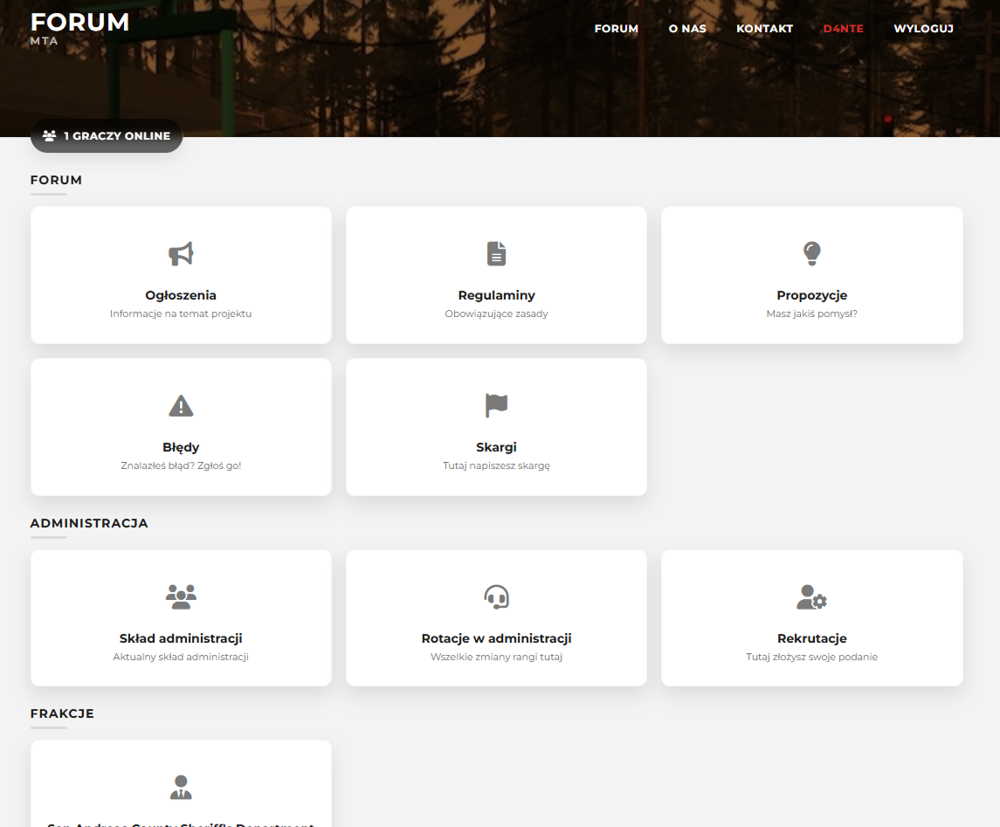
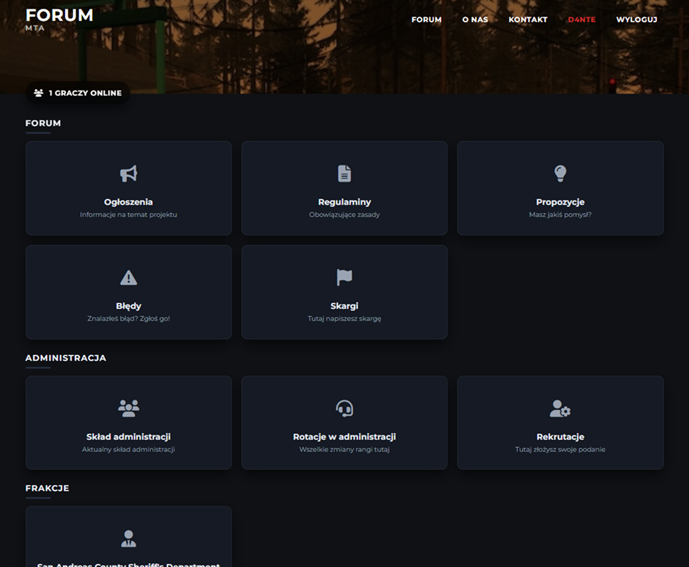

# Silnik forum na serwery gier (pierwotnie pod MTA:SA)
W pełni sprawny silnik forum, z możliwością rozbudowy. Kod napisany w PHP, wydany na licencji GNUv3.
Korzystajcie jak chcecie, jedynie prosiłbym o zostawnie autora w stopce.

# Co posiada forum?
- Bazowy szkielet forum, strukturę działów oraz tematów i odpowiedźi.
- System kont, logowanie i rejestrację.
- Lista tematów w dziale z paginacją.
- Tworzenie tematów.
- Tworzenie odpowiedzi w tematach.
- Profile użytkowników.
- Notyfikacje.
- Dwa style ciemny oraz jasny.

# Czego brakuje?
- Panelu ACP.
- Struktury zawierajacej kategorie, narazie są to same działy.

# Autorzy
- D4NTE (github.com/D4NTE98)

# Prezentacja

.
.
